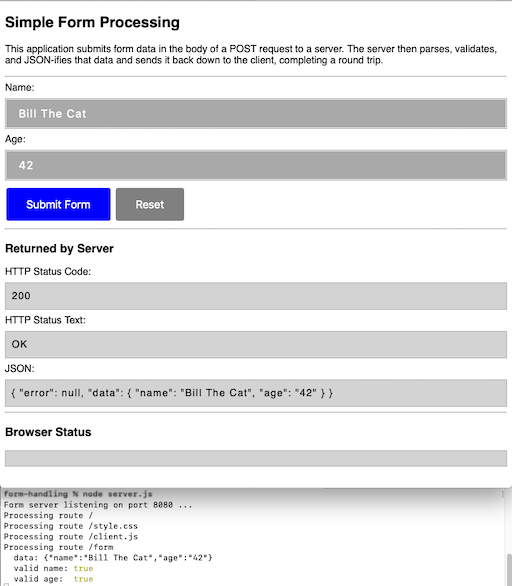

# Learn NodeJS

Curating my collection of NodeJS-related code sketches.

# [Contents](#contents)

- [Form Handling](#form-handling)
- [JSON UI](#json-ui)

-----

## [Form Handling](#contents)

This [node server](form-handling/server.js) illustrates how to process incoming form data.  As a bonus, it round-trips the data back to the client as JSON.

## [JSON UI](#contents)

This is a very simple example of creating a JSON-driven user interface using the mustache template engine on the client to transform JSON and an HTML template from the server into a client-rendered HTML page.
